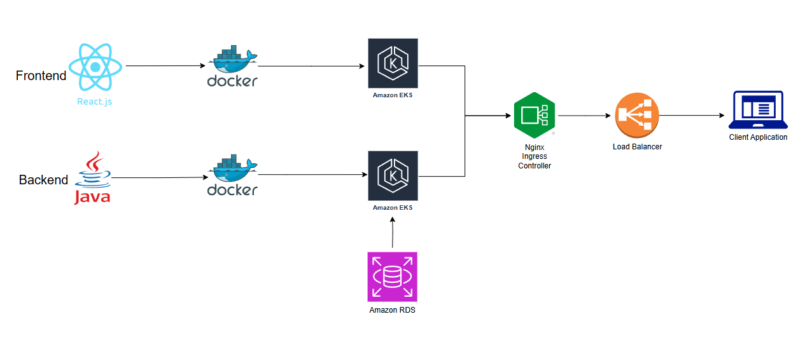
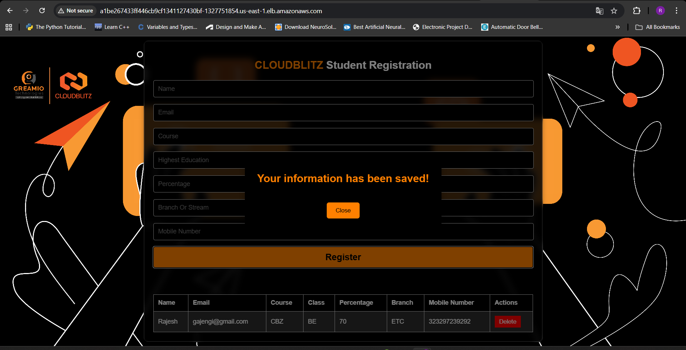
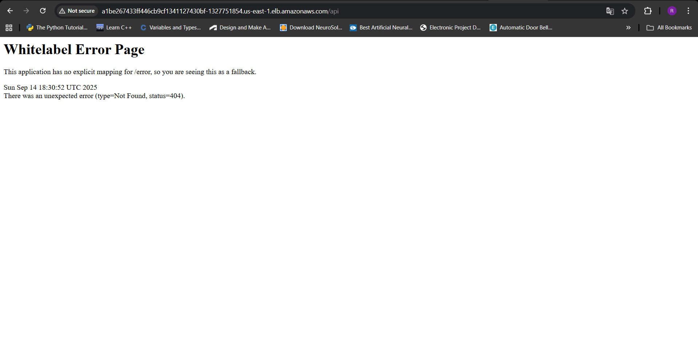
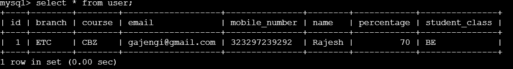
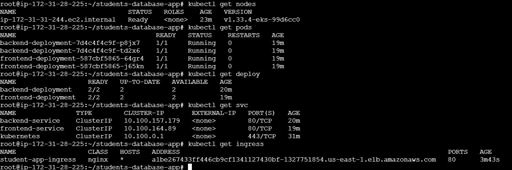

# Cloud-Native DevOps Pipeline: 3-Tier Application Deployment on Kubernetes with Ingress

## 📌 About the Project
This project demonstrates a complete DevOps workflow for a 3-tier web application deployed on AWS EKS with Amazon RDS as the managed database. The application consists of:
- Frontend (UI Layer) → Node.js with npm
- Backend (API Layer) → Java with Spring Boot (managed using Maven) 
- Database (Data Layer) → MySQL hosted on Amazon RDS

The project showcases containerization, Kubernetes deployment on EKS, and service exposure using Kubernetes Ingress.

## ✨ Features

- ✅ Multi-tier architecture (Frontend, Backend, Database)
- ✅ AWS EKS for Kubernetes cluster orchestration
- ✅ Amazon RDS for managed database services
- ✅ Separate Dockerfiles for each tier
- ✅ Push Docker images to Docker Hub
- ✅ Kubernetes manifests for each tier
- ✅ Kubernetes Services (ClusterIP) for internal communication between components, with Ingress handling external communication
- ✅ Ingress routing:
    - `/` → Frontend service (UI)
    - `/api` → Backend service (API)
- ✅ Modular and scalable design

## 🛠️ Tech Stack

- Version Control → Git, GitHub
- Containerization → Docker, Docker Hub
- Orchestration → Kubernetes on AWS EKS
- Backend → Java, Spring Boot, Maven
- Frontend → Node.js, npm
- Database → MySQL on Amazon RDS
- Ingress → NGINX Ingress Controller
- Secrets Management → Kubernetes Secrets
<!-- - Future CI/CD → Jenkins / GitHub Actions
- Future Monitoring & Logging → Prometheus, Grafana, ELK Stack -->

## 📂 Project Structure
```
devops-3tier-app/
│── app/
│   ├── frontend/                 # Frontend code (Node.js with npm)
│   │   └── Dockerfile
│   ├── backend/                  # Backend API code (Java with Spring Boot)
│   │   └── Dockerfile
│   └── database/                 # Database initialization scripts (MySQL)
│       └── init.sql
│
│── docker/
│   ├── frontend.Dockerfile
│   ├── backend.Dockerfile
│   └── database.Dockerfile       # Optional, if containerizing DB
│
│── k8s/
│   ├── frontend-deployment.yaml
│   ├── frontend-service.yaml
│   ├── backend-deployment.yaml
│   ├── backend-service.yaml
│   ├── db-deployment.yaml        # Optional
│   ├── db-service.yaml           # Optional
│   ├── ingress.yaml  
│   └── secret.yaml               # Database credentials and connection details are stored securely using Kubernetes Secrets.
│
│── docs/
│   ├── architecture.png
│   └── flow.
│   ├── frontend.png
│   └── backend.png
│   ├── database-result.png
│   └── k8s-results.png
│
│── README.md

```
<!-- │
│── scripts/
│   ├── build.sh
│   ├── push.sh
│   └── deploy.sh
│ -->

## 🏗️ Architecture



## 🔑 Prerequisites

- Git → to clone the repository
- Docker & Docker Hub account → build & push images
- Kubernetes cluster (Minikube/EKS/GKE/AKS)
- kubectl CLI
- Ingress Controller (NGINX or any other --> required for external access, since services are ClusterIP)

## 🔄 Flow of Project

1. Clone the repository containing the application code (Frontend, Backend, Database scripts)
2. Dockerize each component
3. Push images to Docker Hub
4. Deploy each component in Kubernetes (Deployments + Services)
5. Configure Ingress to route traffic: / → frontend, /api → backend
6. Test full-stack flow (Frontend → Backend → Database)
<!-- 5. Configure Ingress for frontend access (maps external traffic to services) -->

## 🛠️ Steps

### 1️⃣ Clone Application
```bash
git clone https://github.com/RajeshGajengi/students-database-app.git
```

### 2️⃣ Create Database using RDS
Once the database is created, install the MySQL client and connect to RDS:
```bash
apt install mysql-client -y  # install mysql-client

mysql -h <DNS of RDS> -u <user-name> -p   # connect to rds
```
Create the database:
```sql
CREATE DATABASE student_db;
```
Now your databse is ready to integrate with Backend.

### 3️⃣ Dockerize Each Tier
```bash
# Backend
docker build -t <dockerhub-username>/backend:latest -f docker/backend.Dockerfile ./app/backend

# Frontend
docker build -t <dockerhub-username>/frontend:latest -f docker/frontend.Dockerfile ./app/frontend

# Database (if using custom DB image)
docker build -t <dockerhub-username>/db:latest -f docker/database.Dockerfile ./app/database
```

### 4️⃣ Push Images
```bash
docker push <dockerhub-username>/frontend:latest
docker push <dockerhub-username>/backend:latest
docker push <dockerhub-username>/db:latest
```

### 5️⃣ Deploy on Kubernetes
```bash
kubectl apply -f k8s/secret.yaml
kubectl apply -f k8s/backend-deployment.yaml
kubectl apply -f k8s/backend-service.yaml
kubectl apply -f k8s/frontend-deployment.yaml
kubectl apply -f k8s/frontend-service.yaml
kubectl apply -f k8s/ingress.yaml
kubectl apply -f k8s/db-deployment.yaml  # Optional 
```
Before applying ingress, install the NGINX Ingress Controller:
```bash
kubectl apply -f https://raw.githubusercontent.com/kubernetes/ingress-nginx/main/deploy/static/provider/cloud/deploy.yaml
```
### 6️⃣ Verify Deployment
```bash
kubectl get pods
kubectl get svc
kubectl get ingress
```

<!-- ## 📊 Workflow Diagram
```

``` -->

## Results

**Frontend Result**

**Backend API**

**Database Result**

**Kubernetes Results: Pods, Services, Ingress**



<!-- 🔄 CI/CD (Future Integration)

Automate build and deployment with Jenkins pipeline or GitHub Actions

Pipeline stages:

Code Checkout → Build → Dockerize → Push to Registry → Deploy to Kubernetes

Add quality gates with SonarQube

Implement automated tests (unit + integration)

📡 Monitoring & Logging (Future Integration)

Prometheus + Grafana → Metrics and dashboards for application + cluster health

ELK Stack (Elasticsearch, Logstash, Kibana) → Centralized logging

Alertmanager → Alerting on failures -->


## 🔮 Future Enhancements

- Integrate Jenkins pipeline for full CI/CD
- Replace plain YAML manifests with Helm charts
- Extend monitoring and logging with full observability stack
- Implement Horizontal Pod Autoscaler (HPA) for auto-scaling


## 👨‍💻 Author
Developed by Rajesh
